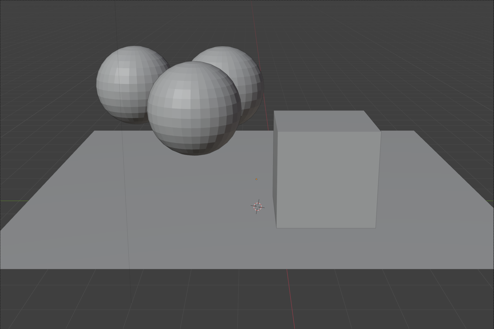
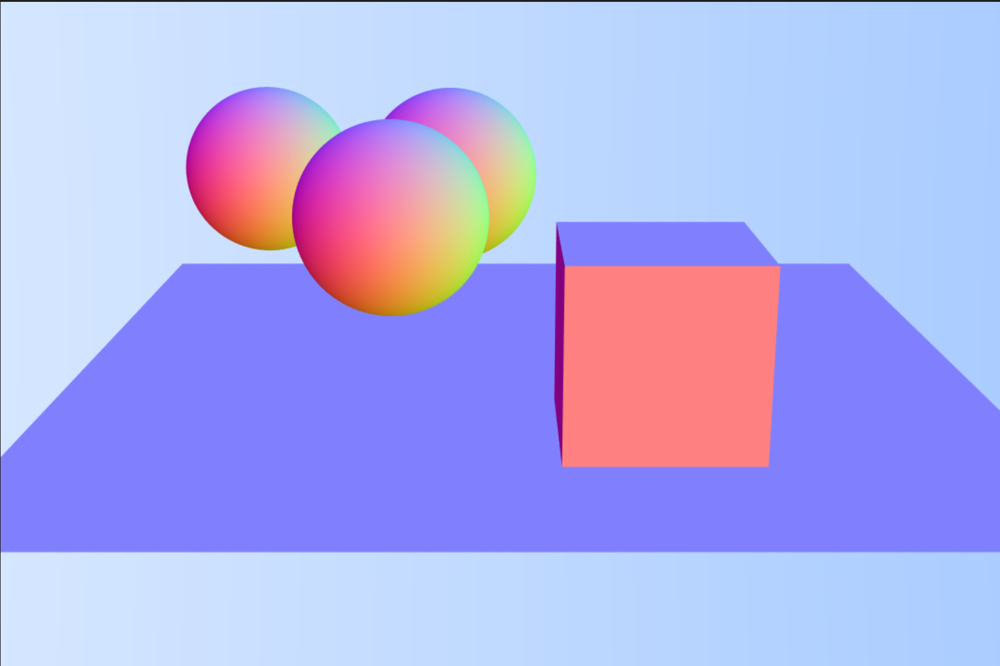
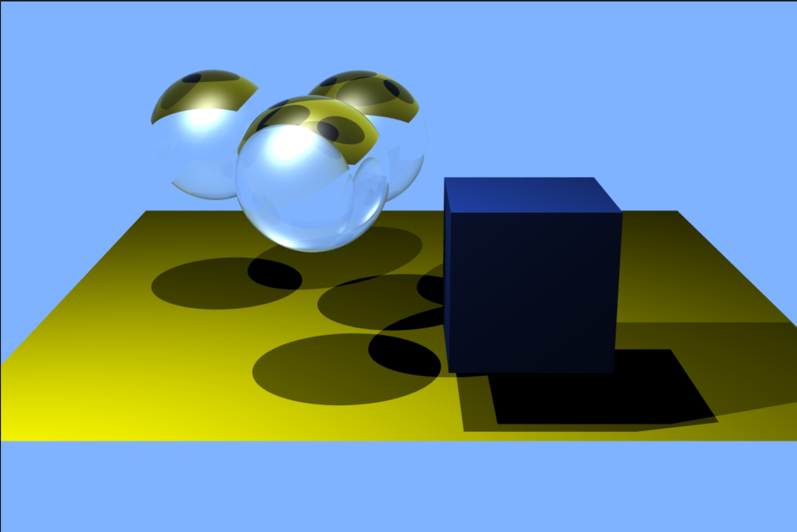

# Ray Tracer (C++/Blender • Whitted-Style)

A from-scratch CPU ray tracer written in modern C++.

Features include pinhole camera, Whitted recursion (reflection/refraction), BVH acceleration, anti-aliasing, and texture mapping via `.ppm`. No external libraries are required; image I/O, math, and scene parsing are implemented by hand.

---

## Project Features

- 🎥 **Camera**
  - Pinhole model with pixel-to-world ray generation
  - Image plane setup (sensor size, focal length), FOV control
- 🧱 **Geometry & Intersection**
  - Sphere, Plane, Axis-Aligned Box; unified `HitRecord` (point, normal, t, uv)
  - `hittable_list` for scene aggregation
- ⚡ **Acceleration**
  - AABB + **BVH** (bounding volume hierarchy)
  - Toggle BVH on/off to benchmark speedup
- 💡 **Shading (Whitted)**
  - Direct lighting with Blinn–Phong
  - Recursive **mirror reflection** and **dielectric refraction** (Fresnel, total internal reflection)
- 🧪 **Materials**
  - `lambertian` (diffuse), `metal` (specular), `dielectric` (glass with IOR)
  - Solid colors + **textures** (UV sampling from `.ppm`)
<!-- 
- 🖼 **Textures**
  - `ImageTexture` (PPM), procedural checker, UV debug map
  - Spherical / cubic / planar UVs
-->
- 🧹 **Anti-Aliasing**
  - Stratified/jittered supersampling per pixel with gamma correction
<!-- 
- ⚙️ **CLI Controls**
  - Resolution, samples-per-pixel, max recursion depth, BVH on/off, output path, seed
- 📁 **Clean Structure & CMake**
  - Build with CMake; single executable; no third-party dependencies
-->
---

## Gallery
  
  


\* Caustics are approximated via Whitted recursion; not physically accurate.

---

## How to Build (Windows/macOS/Linux)

### Prerequisites
- C++17+ compiler (MSVC, Clang, or GCC)
- CMake 3.20+

### Build
```bash
# From repo root
cmake -S . -B build -DCMAKE_BUILD_TYPE=Release
cmake --build build --config Release --parallel
```

<!--
## Project structure📂:
-->
